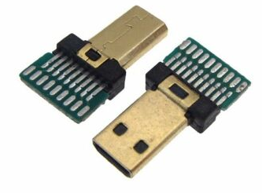

## Target: Second generation Panologic thin client

 

If you don't know what a Panologic thin client then see [this](https://hackaday.com/2013/01/11/ask-hackaday-we-might-have-some-fpgas-to-hack/) 
article and refer to the links at the bottom of this page for further reading.

### HW Requirements

* A Panologic G2 thin client (the one with a DVI port)
* A suitable 5 volt power supply
* A JTAG programmer to load the bitstream into the FPGA.

## Software Requirements

* Xilinx [ISE 14.7](https://www.xilinx.com/support/download/index.html/content/xilinx/en/downloadNav/vivado-design-tools/archive-ise.html)
* xc3sprog
* gcc built for RISC-V RV32IM
* GNU make

The free Webpack version of Xilinx [ISE 14.7](https://www.xilinx.com/support/download/index.html/content/xilinx/en/downloadNav/vivado-design-tools/archive-ise.html) is used for development.
Download the latest Windows 10 version which supports the Spartan 6 family of 
chips used in the second generation Panologic device.

### Building bitfile from sources

**NB:** While it may be possible to use Windows for development I haven't 
tried it and don't recommend it.

1. Clone the https://github.com/skiphansen/fpga_test_soc repository
2. cd into .../fpga_test_soc/fpga/panologic_g2
3. If you have a **REV B** Pano with the larger FPGA then just run "make", 
   otherwise if you have a **REV C** then run "make PART_NAME=xc6slx100".

```
skip@dell-790:~/pano/localref/fpga_test_soc/fpga/panologic_g2$ make
####################################################################
# ISE: Synth
####################################################################
Reading design: fpga.prj

... lots of output deleted ...

Running DRC.
DRC detected 0 errors and 0 warnings.
Creating bit map...
Saving bit stream in "fpga_routed.bit".
Bitstream generation is complete.
skip@dell-790:~/pano/localref/fpga_test_soc/fpga/panologic_g2$ 
```

### Loading the bitfile

Install xc3sprog for your system.  If a binary install isn't available for your
system the original project can be found here: https://sourceforge.net/projects/xc3sprog/.
Sources can be checked out using subversion from https://svn.code.sf.net/p/xc3sprog/code/trunk.

As an alternate if you don't have subversion a fork of the original project
can be found here: https://github.com/Ole2mail/xc3sprog.git .

If your JTAG cable is not a Digilent JTAG-HS2 then you will need to set the
"CABLE" environment variable to your cable type before loading the bit file.

Refer to the supported hardware [web page](http://xc3sprog.sourceforge.net/hardware.php) page or run  xc3sprog -c 
to find the correct cable option for your device.

Once xc3sprog has been in installed load bit file by running "make load".

```
skip@dell-790:~/pano/working/fpga_test_soc/fpga/panologic_g2$ export CABLE=jtaghs2
skip@dell-790:~/pano/working/fpga_test_soc/fpga/panologic_g2$ make load
xc3sprog -c jtaghs2 project/fpga_routed.bit
XC3SPROG (c) 2004-2011 xc3sprog project $Rev: 774 $ OS: Linux
Free software: If you contribute nothing, expect nothing!
Feedback on success/failure/enhancement requests:
        http://sourceforge.net/mail/?group_id=170565
Check Sourceforge for updates:
        http://sourceforge.net/projects/xc3sprog/develop

Using Libftdi,
DNA is 0x1927bec012fa2fff
skip@dell-790:~/pano/working/fpga_test_soc/fpga/panologic_g2$
```

### Hello world !

To build the firmware, make sure the RISC-V GCC (built for RV32IM) is in the 
PATH, then:

1. cd into .../fpga_test_soc/src_c
2. run make.

```
skip@dell-790:~/pano/working/fpga_test_soc/src_c$ export PATH=/opt/riscv32i/bin/:$PATH
skip@dell-790:~/pano/working/fpga_test_soc/src_c$ make
# Compiling boot.S
# Compiling main.c
# Compiling uart_lite.c
... lots of output deleted ...
# Compiling timer.c
# Building hello_world
skip@dell-790:~/pano/working/fpga_test_soc/src_c$
```

Now that the firmware has been built we can run it by running "make run" 
specifing your serial device.  Note: Change the port to match your system.
It may be necessary to run make as root depending on your serial port's 
premissions.

```
skip@dell-790:~/pano/working/fpga_test_soc/src_c$ make run TARGET_PORT=/dev/ttyUSB1
../run.py -d /dev/ttyUSB1 -b 1000000 -f  build.riscv.hello_world/hello_world
/home/skip/pano/working/fpga_test_soc/run/poke.py -t uart -d /dev/ttyUSB1 -b 1000000 -a 0xF0000000 -v 0x0
/home/skip/pano/working/fpga_test_soc/run/load.py -t uart -d /dev/ttyUSB1 -b 1000000 -f build.riscv.hello_world/hello_world -p ''
ELF: Loading 0x0 - size 8KB
 |XXXXXXXXXXXXXXXXXXXXXXXXXXXXXXXXXXXXXXXXXXXXXXXXXX| 100.0%
/home/skip/pano/working/fpga_test_soc/run/console-uart.py -t uart -d /dev/ttyUSB1 -b 1000000 -f build.riscv.hello_world/hello_world
helloworld!
helloworld!
helloworld!
helloworld!
helloworld!
helloworld!
helloworld!
helloworld!
```


### Serial port 

We will use the DDC port on the micro HDMI port for our serial port.  This
will leave the DVI port available for a display if needed. 

| HDMI Signal | Pin   | Serial signal |
| ----------- | ----- | ------------- |
| DDC SCL     |  15   |   PC -> Pano  |
| DDC SDA     |  16   |   Pano -> PC  |
| Ground      |  17   |   Ground      |

An 3.3 volt compatible serial port adapter and an homebrew adapter cable is 
required.  

I use a FTDI [TTL-232R-3V3](https://www.digikey.com/product-detail/en/ftdi-future-technology-devices-international-ltd/TTL-232R-3V3/768-1015-ND/1836393)
with an adapter that I built from a micro HDMI to HDMI adapter cable.

 

To build the adapter I cut the micro to mini adapter cable, stripped the wires, 
identified the correct wires and then soldered them to .1 inch pin header to
mate with my serial adapter.  While I was eventually able to get the cable to 
work however **I DO NOT RECOMMEND** following my lead.  The wires in the 
adapter cable are VERY tiny and were very difficult to work with.

If I were to do again I would use a micro HDMI to HDMI cable and a HDMI breakout 
board.  This would be much easier to wire and would be more robust physically 
than the approach I took.

 

 

[Adafruit](https://www.adafruit.com/product/3121) has an inexpensive breakout 
board that looks like it would be perfect.

Here's another inexpensive [possibility](https://www.ebay.com/itm/Micro-Mini-HDMI-Male-Connector-Plug-Breakout-Board-19P-Solder-Pad-Pack-of-2/303360754286).

 


### Pano Links

- [Gitter](https://gitter.im/panologic/community) chat room for Panologic hackers.
- Group.io [group](https://groups.io/g/panohackers/topics) for discussions about Panologic hacking 
- [Original Hackaday](https://hackaday.com/2013/01/11/ask-hackaday-we-might-have-some-fpgas-to-hack/) article from 2013.  
- Hackaday article on Tom's [Raytracker](https://hackaday.com/2018/12/07/racing-the-beam-on-a-thin-client-in-fpgas/).  
- Hackaday article on my [Pacman](https://hackaday.com/2019/01/11/pac-man-fever-comes-to-the-pano-logic-fpga/) project.  
- Hackaday article on Tom's [Joystick adapter](https://hackaday.com/2019/02/11/two-joysticks-talk-to-fpga-arcade-game-over-a-vga-cable/).  
- Wenting Zhang's [VerilogBoy](https://github.com/zephray/VerilogBoy) project.
- Hackaday article on My [pano_progfpga](https://hackaday.com/2019/04/19/pano-logic-fgpa-hacking-just-got-easier/) project
- My [prog_fpga](https://github.com/skiphansen/pano_progfpga) project.
- My [pacman](https://github.com/skiphansen/pano_man) project.
- My [Hello World](https://github.com/skiphansen/pano_hello_g1) project.
- My [USB sniffer](https://github.com/skiphansen/usb_sniffer/blob/master/fpga/panologic_g2/README.md) project.
- https://github.com/tomverbeure/panologic
- G1 [Schematics!](https://github.com/twj42/PanoLogicG2_ReverseEngineering/blob/master/files/G1_Schematics.zip)
- https://github.com/tomverbeure/panologic-g2
- https://twj42.github.io/PanoLogicG2_ReverseEngineering/

