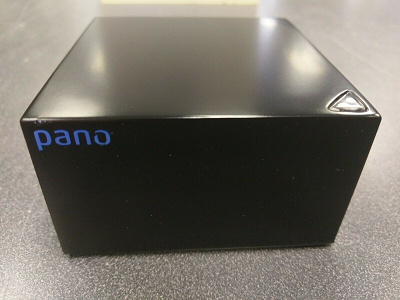
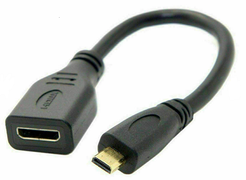
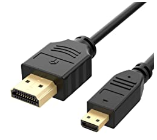
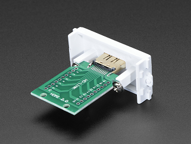

## Target: Second generation Panologic thin client

 

If you don't know what a Panologic thin client then see [this](https://hackaday.com/2013/01/11/ask-hackaday-we-might-have-some-fpgas-to-hack/) 
article and refer to the links at the bottom of this page for further reading.

### HW Requirements

* A Panologic G2 thin client (the one with a DVI port)
* A suitable 5 volt power supply
* A JTAG programmer to load the bitstream into the FPGA.

### Building from sources

**NB:** While it may be possible to use Windows for development I haven't 
tried it and don't recommend it.

1. Clone the https://github.com/skiphansen/fpga_test_soc repository
2. cd into .../fpga_test_soc/fpga/panologic_g2
3. If you have a **REV B** Pano with the larger FPGA then just run "make", 
   otherwise if you have a **REV C** then run "make PART_NAME=xc6slx100".

### Serial port 

We will use the DDC port on the micro HDMI port for our serial port.  This
will leave the DVI port available for a display if needed. 

| HDMI Signal | Pin   | Serial signal |
| ----------- | ----- | ------------- |
| DDC SCL     |  15   |   PC -> Pano  |
| DDC SDA     |  16   |   Pano -> PC  |
| Ground      |  17   |   Ground      |

An 3.3 volt compatible serial port adapter and an homebrew adapter cable is 
required.  

I use a FTDI [TTL-232R-3V3](https://www.digikey.com/product-detail/en/ftdi-future-technology-devices-international-ltd/TTL-232R-3V3/768-1015-ND/1836393)
with an adapter that I built from a micro HDMI to HDMI adapter cable.

 

To build the adapter I cut the micro to mini adapter cable, stripped the wires, 
identified the correct wires and then soldered them to .1 inch pin header to
mate with my serial adapter.  While I was eventually able to get the cable to 
work I **DO NOT RECOMMEND** following my lead.  The wires in the adapter cable 
are VERY tiny and were very difficult to work with.

If I were to do again I would use a micro HDMI to HDMI cable and a HDMI breakout 
board.  This would be much easier to wire and would be more robust physically 
than the approach I took.

 

 

[Adafruit](https://www.adafruit.com/product/3121) has an inexpensive breakout 
board that looks like it would be perfect.

### Status

The bit file build and the hello world program can be run, however the output 
doesn't match the expected output. I'm in the process of investigating the
problem.

### Pano Links

- [Gitter](https://gitter.im/panologic/community) chat room for Panologic hackers.
- Group.io [group](https://groups.io/g/panohackers/topics) for discussions about Panologic hacking 
- [Original Hackaday](https://hackaday.com/2013/01/11/ask-hackaday-we-might-have-some-fpgas-to-hack/) article from 2013.  
- Hackaday article on Tom's [Raytracker](https://hackaday.com/2018/12/07/racing-the-beam-on-a-thin-client-in-fpgas/).  
- Hackaday article on my [Pacman](https://hackaday.com/2019/01/11/pac-man-fever-comes-to-the-pano-logic-fpga/) project.  
- Hackaday article on Tom's [Joystick adapter](https://hackaday.com/2019/02/11/two-joysticks-talk-to-fpga-arcade-game-over-a-vga-cable/).  
- Wenting Zhang's [VerilogBoy](https://github.com/zephray/VerilogBoy) project.
- Hackaday article on My [pano_progfpga](https://hackaday.com/2019/04/19/pano-logic-fgpa-hacking-just-got-easier/) project
- My [prog_fpga](https://github.com/skiphansen/pano_progfpga) project.
- My [pacman](https://github.com/skiphansen/pano_man) project.
- My [Hello World](https://github.com/skiphansen/pano_hello_g1) project.
- My [USB sniffer](https://github.com/skiphansen/usb_sniffer/blob/master/fpga/panologic_g2/README.md) project.
- https://github.com/tomverbeure/panologic
- G1 [Schematics!](https://github.com/twj42/PanoLogicG2_ReverseEngineering/blob/master/files/G1_Schematics.zip)
- https://github.com/tomverbeure/panologic-g2
- https://twj42.github.io/PanoLogicG2_ReverseEngineering/

